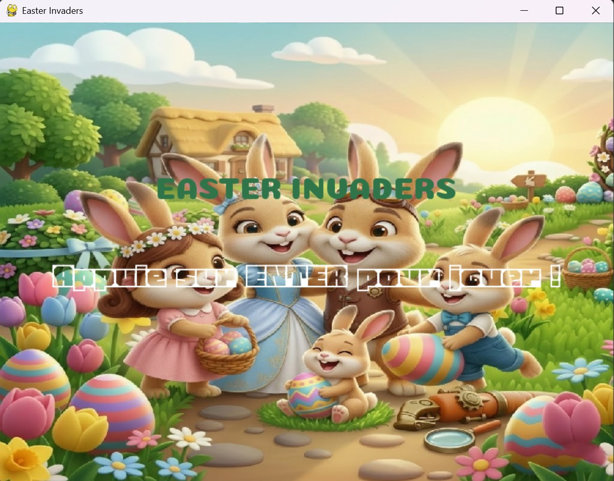

# 🐰 EASTER INVADERS — Python / Pygame

> Création en Python/Pygame d'un jeu de type Space Invaders sur le thème de Pâques,  
> initialement développé en HTML5/CSS3/JavaScript disponible sur mon GITHUB.

## 🎮 Description du jeu

Easter Invaders est un jeu de tir inspiré de Space Invaders.  
Le joueur incarne Papa Lapin qui doit défendre sa famille contre des vagues d'ennemis de Pâques.

- **3 types d'ennemis** : Œuf (100 pts), Cloche (200 pts), Poulet (300 pts)
- **Système de vies** : 3 vies représentées par des cœurs ❤️
- **Niveaux progressifs** : chaque niveau ajoute des ennemis supplémentaires (en cours d'amélioration)
- **Délai de tir** : rechargement de 400ms entre chaque balle
- **Écran d'accueil** et **Game Over** avec réinitialisation complète (menu en cours de création)

---

## 🛠️ Technologies utilisées

| Technologie | Utilisation |
|---|---|
| Python 3.11 | Langage principal |
| Pygame 2.6 | Moteur graphique et gestion des événements |

## 🚀 Installation et lancement

### Prérequis

- Python 3.11 (⚠️ Pygame n'est pas compatible avec Python 3.14+)
- Pygame 2.6

### Installation de Pygame

py -3.11 -m pip install pygame

### Lancer le jeu

py -3.11 jeu.py

## 🕹️ Contrôles

| Touche | Action |
|---|---|
| ← / → | Déplacer le lapin |
| Espace | Tirer |
| Entrée | Démarrer / Valider |

## 🔄 Du JavaScript au Python — Ce que j'ai appris

Ce projet est la **Création en Python** de mon jeu Easter Invaders,  
initialement développé en HTML5 Canvas / JavaScript / CSS.

### Comparaison des deux versions

| Concept | JavaScript (version originale) | Python/Pygame (cette version) |
|---|---|---|
| Boucle de jeu | `requestAnimationFrame()` | `while running` + `horloge.tick(60)` |
| Temps écoulé | `Date.now()` | `pygame.time.get_ticks()` |
| Dessin à l'écran | `ctx.drawImage()` | `fenetre.blit()` |
| Effacer l'écran | `ctx.clearRect()` | `fenetre.fill()` |
| Afficher | automatique | `pygame.display.flip()` |
| Touches pressées | `addEventListener('keydown')` | `pygame.key.get_pressed()` |
| Stocker les ennemis | tableau d'objets `[]` | liste de dictionnaires `[]` |
| Collisions | fonction `hit(a, b)` manuelle | même logique rectangulaire |
| Texte à l'écran | `ctx.fillText()` | `font.render()` + `blit()` |

### Ce qui change vraiment

En JavaScript, le navigateur gère le rendu automatiquement.  
En Python avec Pygame, **tout est manuel** :
- On efface l'écran à chaque frame avec `fill()`
- On redessine tout dans l'ordre
- On appelle `flip()` pour afficher le résultat

Cela permet de comprendre exactement ce qui se passe à chaque image du jeu.

### Ce que j'ai appris en Python

- Les **variables**, **conditions**, **boucles** et **fonctions** de base
- Les **listes** et **dictionnaires** pour stocker les données du jeu
- Le **f-string** : `f"Score : {score}"`
- Le **modulo** `%` pour alterner les types d'ennemis
- La gestion des **images** et **polices** avec Pygame
- La structure d'une **boucle de jeu** professionnelle

## 📌 Version JS originale

La version JavaScript originale du jeu est disponible séparément.  
Elle inclut 20 niveaux, des formations d'ennemis variées, un scénario narratif,  
un système de classement localStorage et des contrôles mobiles.

**HAMDOUN Nada** 

## Capture d'écran du jeu en cours de création ##

